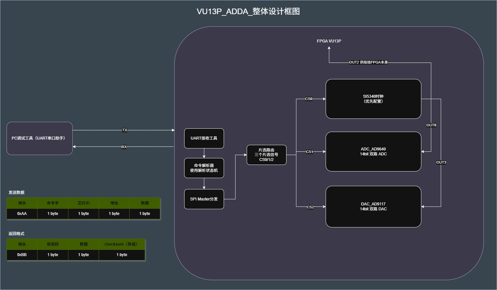

# ADDA 测试框架

面向 **Xilinx VU13P + SI5340 / AD9640 / AD9117** 的 FPGA 调试与验证框架：UART 命令、三芯片 SPI 自动 boot、ADC IQ DSP 链、DAC 2× DDR 发射，以及 PySide6 / Python 测试工具链。

**Vivado 顶层模块：** `rf_adda_top`

> 个人开源作品集，展示 BES（恒玄科技）实习期间的 FPGA 验证工程实践。不含公司内部文档、未授权原理图或未脱敏板卡资料。引脚约束需结合具体板卡自行准备（参考 `constraints/adda_io.template.xdc`），clone 后不能直接综合上板。

许可证：[MIT](LICENSE)（第三方模块见 [THIRD_PARTY_NOTICES.md](THIRD_PARTY_NOTICES.md)）

---

## 功能亮点

| 方向 | 内容 |
|------|------|
| 端到端调试 | UART Ping → SPI → 自动 boot → ADC 采集 → DAC 波形 |
| UART 协议 | 921600 8N1；SPI、boot、ADC 快照/流式、DAC 音调/波形、RX 链配置 |
| 零 PC boot | `boot_fsm` + `boot_rom` 驱动三芯片上电初始化 |
| RX DSP 链 | CIC → DDC → IQ 平衡 → FIR → BRAM 快照 / UART 流式输出 |
| TX 2× DDR | 半带插值 + ODDRE1 I/Q 交织；DCLKIO 相位可选 |
| 主机工具 | PySide6 GUI + CLI 采集 / FFT / 波形上传 |
| 仿真 | 11 个测试台（UART、boot、TX/RX 链路） |

---

## 架构总览



```
rf_adda_top
├── clk_wiz_0 / clk_wiz_1 + dac_dclk_phase_mux
├── rf_ctrl_path          ← UART + SPI + boot + DAC
├── adc_iq_rx_chain
├── dac_tone_gen / dac_wave_player → tx_iq_dsp → tx_ddr_out
└── led_status
```

---

## 快速上手

1. 复制引脚模板，按实际原理图填写 `PACKAGE_PIN`：

   ```bash
   copy constraints\adda_io.template.xdc constraints\adda_io.xdc
   ```

2. 如需调整时钟配置，重新生成 boot ROM，参考 [`init_tables/README.md`](init_tables/README.md)；默认配置（122.88 MHz）已就绪。

3. Vivado：顶层设 `rf_adda_top`，约束文件 = `adda_io.xdc` + `adda_clocks.xdc` + `adda_dac_ddr.xdc`。

4. 安装主机工具并启动 GUI：

   ```bash
   pip install -r tools/adda/requirements.txt
   python tools/adda/gui/adda_test_gui_qt.py
   ```

---

## 文档索引

| 文档 | 说明 |
|------|------|
| [`docs/uart_command_protocol.md`](docs/uart_command_protocol.md) | UART 命令协议完整参考 |
| [`tools/README.md`](tools/README.md) | Python 工具目录说明 |
| [`docs/wave/README.md`](docs/wave/README.md) | DAC 参考波形格式与幅度约定 |
| [`init_tables/README.md`](init_tables/README.md) | boot ROM 生成流程 |

芯片数据手册请从厂商官网获取：

| 芯片 | 官网 |
|------|------|
| SI5340 | [silabs.com](https://www.skyworksinc.com/en/Products/Timing/Ultra-Low-Jitter-Clock-Generators/Si5340A) |
| AD9640 | [analog.com](https://www.analog.com/en/products/ad9640.html) |
| AD9117 | [analog.com](https://www.analog.com/en/products/ad9117.html) |

---

## 仿真

将仿真顶层设为 `tb_uart_cmd_parser`，在 XSim 中运行 `run -all`，预期输出 `tb_uart_cmd_parser: PASS`。

---

## 备注

- 目标器件示例：`xcvu13p-fhga2104-2-i`（请按实际板卡调整）。
- `SYS_CLK_HZ` = `122_880_000`，须与 `clk_wiz_0` 输出频率一致。
- 不含公司内部文档、未授权原理图、真实板级管脚约束或未脱敏硬件资料。
- 传感器/芯片厂商寄存器表、数据手册等受版权约束的文件**未包含或未跟踪**；初始化表仅为个人联调配置，不代表厂商推荐设置。
- Xilinx IP 与第三方模块遵循各自许可条款（见 [THIRD_PARTY_NOTICES.md](THIRD_PARTY_NOTICES.md)）。
